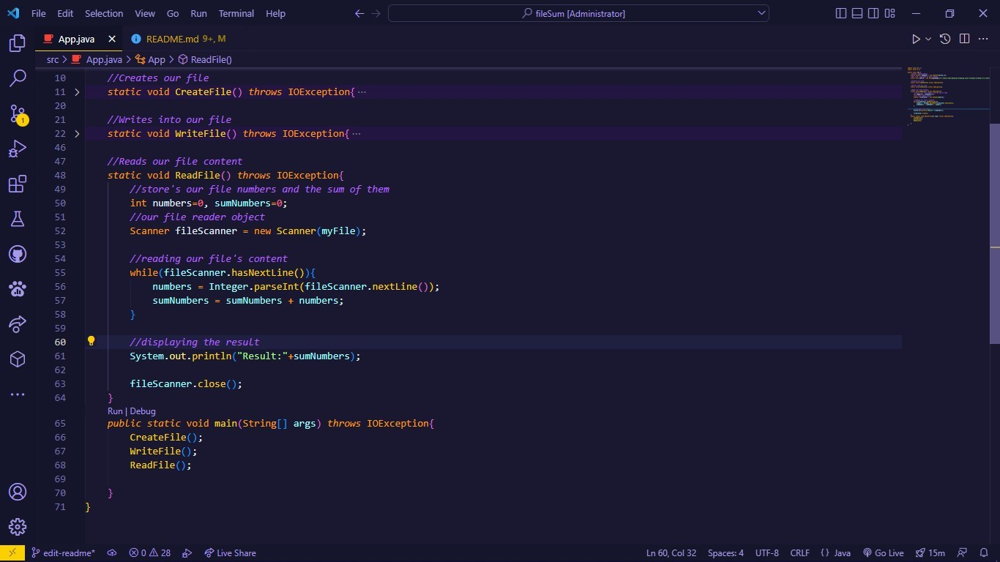

<style>*{scroll-behavior:smooth;}</style>

<div id="top">

### File Exercice

 _ExerciceDescription:_ Create a file that receives 5 numbers and present the result of the sum of those numbers.
</div>

#### Features

- Commented code

```
    //Global reading object
    static Scanner myReader = new Scanner(System.in);
    //Our file, available to every method
    static File myFile = new File("C://Users//yourName//Desktop//Studying Java//fileSum//fileSum//src//myFile.txt");
```

- Descriptible variables

```
    //our writing object
    FileWriter myWriter = new FileWriter(myFile);

    //our counter
    int t=0;

    //store's our file numbers and the sum of them
    int numbers=0, sumNumbers=0;

    //our file reader object
    Scanner fileScanner = new Scanner(myFile);
```

- Clean and readable code

```
    public static void main(String[] args) throws IOException{
      CreateFile();
        WriteFile();
           ReadFile();
    }
```

- Each task separated by methods

```
    //Creates our file
    static void CreateFile() throws IOException{...}

    //Writes into our file
    static void WriteFile() throws IOException{...}

    //Reads our file
    static void ReadFile() throws IOException{...}

        public static void main(String[]args) thrwos IOException{
            CreateFile();
            WriteFile();
            ReadFile();
        }
```

#

This code is **open source** and you can use it for everything you want. It's clean, easy to understand and a extremly simple java program.

### How to use it

#

1. _put the folder in yourName/Desktop directory_

```
C:/
|
|___yourName/
           |
           |_____Desktop/
                       |
                       |_______fileSum
```

#

2. _change the system username_

```
❌ static File myFile = new File("C://Users//public//Desktop//Studying Java//fileSum//fileSum//src//myFile.txt");

✅ static File myFile = new File("C://Users//yourName//Desktop//Studying Java//fileSum//fileSum//src//myFile.txt");
```

#

3. _open the folder in your favourite IDE_

>_mine is Visual Studio Code_ 😎



#

3. _press <kbd>F5</kbd> and enjoy it !_

```
Windows PowerShell
Copyright (C) Microsoft Corporation. Todos os direitos reservados.

PS C:\Users\yourName\Desktop\Studying Java\fileSum\fileSum>  & 'C:\Program Files\Java\jdk-18.0.1.1\bin\java.exe' '-agentlib:jdwp=transport=dt_socket,server=n,suspend=y,address=localhost:53024' '-XX:+ShowCodeDetailsInExceptionMessages' '-cp' 'C:\Users\yourName\Desktop\Studying Java\fileSum\fileSum\bin' 'App'
Your file was successfully created
Result: 'result will be were'
PS C:\Users\yourName\Desktop\Studying Java\fileSum\fileSum>

```
<div style="display:flex; flex-direction:row;gap:2rem;">

<a href="#top"><button style="background:#f0f150; color:#242424;padding:9px 40px;border:none;border-radius:.40rem; font-weight:600; font-family:poppins; cursor:pointer;">Go back</button></a>

<a href="https://github.com/DevDario/Studying-Java" target="_blank"><button style="background:#f0f150; color:#242424;padding:9px 40px;border:none;border-radius:.40rem; font-weight:600; font-family:poppins; cursor:pointer;">More Java projects</button></a>

</div>